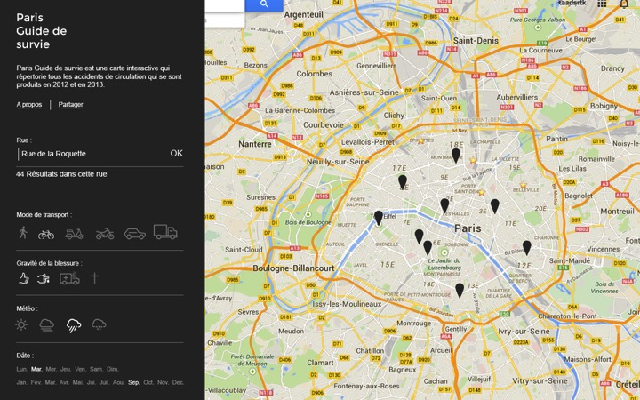

Paris, Survival guide
=====================

This web app shows road accidents in Paris, during 2012 and 2013. Its based on open data, published by the mayor of Paris.

Currently, the app displays crashes between car, motorcycle, bikes and pedestrians.

Note: The frontend part is located in another repository:
[paris-survival-guide-front](https://github.com/miniche/paris-survival-guide-front)

## Context

During a Hackday at [LExpress](http://www.lexpress.fr), we were 3 teams fighting each other to build a project
around opendata.

We got one day to:

 - find the idea
 - find the data
 - build the project
 - make a short 10 minutes presentation

The tag `v1.0` is where the project was by the end of the hackday. We then took few minutes to fix annoying bugs.

## Mockup...

## ...and the final result

After ten hours of work, we have managed to:

- import, analyze and save formatted data
- load data onto an ElasticSearch server
- create the web app, based on the [Bootstrap framework](http://getbootstrap.com/)
- display all crashes on a Google Map
- implement a first filter (mode of transport)

## Results

Sadly, we lost the hackday :(

**Congratulations to the [SharePA team](https://github.com/LExpress/SharePA)!**